# Arc42 Architecture Documentation: Tetris Game

*A beginner-friendly software architecture document for a Next.js Tetris implementation*

---

## Table of Contents

1. [Introduction and Goals](#1-introduction-and-goals)
2. [Architecture Constraints](#2-architecture-constraints)
3. [System Scope and Context](#3-system-scope-and-context)
4. [Solution Strategy](#4-solution-strategy)
5. [Building Block View](#5-building-block-view)
6. [Runtime View](#6-runtime-view)
7. [Deployment View](#7-deployment-view)
8. [Cross-cutting Concepts](#8-cross-cutting-concepts)
9. [Architecture Decisions](#9-architecture-decisions)
10. [Quality Requirements](#10-quality-requirements)
11. [Risks and Technical Debts](#11-risks-and-technical-debts)
12. [Glossary](#12-glossary)

---

## 1. Introduction and Goals

### What is this system?
This is a web-based Tetris game built with Next.js, React, and TypeScript. It implements the classic Tetris gameplay following official guidelines, featuring authentic mechanics like the Super Rotation System (SRS), 7-bag piece randomization, and classic 3D block graphics.

### 🎯 Business Goals
- **Educational**: Demonstrate professional React/Next.js development practices
- **Entertainment**: Provide an authentic Tetris gaming experience
- **Technical Showcase**: Show modern web development techniques

### 🎮 Key Features
- Complete Tetris gameplay with official rules
- Classic 3D visual design with beveled blocks
- Responsive keyboard controls
- Score tracking and level progression
- Hold system and next piece preview
- Pause/resume and game over handling

### 🧑‍💻 For Next.js Beginners
This system shows you:
- How to structure a real Next.js application
- How to manage complex state in React
- How to handle keyboard input and game loops
- How to create reusable TypeScript interfaces
- How to organize code into logical modules

### Stakeholders
- **Players**: Users who play the Tetris game
- **Developers**: Those who maintain or extend the codebase
- **Learners**: People studying Next.js and React development

---

## 2. Architecture Constraints

### Technical Constraints
- **Framework**: Next.js 15.5.2 with App Router
- **Language**: TypeScript for type safety
- **UI Library**: React 19.1.0 with hooks
- **Styling**: Tailwind CSS 4 for responsive design
- **Browser Support**: Modern browsers with ES2017+ support

### 🧑‍💻 For Next.js Beginners
**Why these choices?**
- **Next.js**: Provides optimized React development with built-in features
- **TypeScript**: Catches errors early and improves code documentation
- **Tailwind CSS**: Rapid UI development with consistent styling
- **App Router**: Modern Next.js routing system (newer than Pages Router)

### Development Constraints
- No external game libraries (pure React implementation)
- Client-side only (no server-side game state)
- Keyboard-only controls (no touch/mobile optimization)
- Single-player only

### Legal Constraints
- Must follow official Tetris Guidelines for authenticity
- Educational/demonstration use only

---

## 3. System Scope and Context

### System Context Diagram

```mermaid
graph TB
    Player[👤 Player] 
    Browser[🌐 Web Browser]
    TetrisApp[🎮 Tetris Game Application]
    
    Player -->|Keyboard Input| Browser
    Browser -->|Key Events| TetrisApp
    TetrisApp -->|Visual Output| Browser
    Browser -->|Game Display| Player
    
    subgraph "Next.js Application"
        TetrisApp
    end
```



### 🧑‍💻 For Next.js Beginners
**What this diagram shows:**
- The **Player** interacts with the game through keyboard input
- The **Browser** handles the interface between player and application
- The **Tetris Application** is a self-contained Next.js app
- Everything runs in the browser (client-side)

### External Interfaces
- **Input**: Keyboard events (arrow keys, letter keys)
- **Output**: Visual game display with HTML/CSS
- **Browser APIs**: `requestAnimationFrame`, `setTimeout`, keyboard events

### Business Context
- **Entertainment Software**: Casual gaming application
- **Educational Tool**: Demonstrates web development practices
- **Open Source**: Code available for learning and modification

---

## 4. Solution Strategy

### 🎯 Overall Approach
We built this Tetris game using a **component-based architecture** where each part of the game is a separate, reusable piece.

### 🧑‍💻 For Next.js Beginners
Think of it like building with LEGO blocks:
- Each React component is a LEGO block
- Components can contain other components
- Data flows down from parent to child components
- User actions flow up through event handlers

### Key Architectural Patterns

#### 1. **State Management Pattern**
```
Single Source of Truth → Game State Object → React useState Hook
```
- All game data lives in one place (`TetrisGameState`)
- Components receive state through props
- State updates trigger re-renders automatically

#### 2. **Component Hierarchy Pattern**
```
TetrisGame (Main)
├── GameBoard (Game Display)
│   └── Block (Individual Pieces)
├── ScorePanel (Score Display)
├── NextPiece (Preview)
└── HoldPiece (Stored Piece)
```

#### 3. **Game Loop Pattern**
```
requestAnimationFrame → Update Game Logic → Update State → React Re-render
```

### Technology Decisions

| Technology | Why Chosen | Beginner Benefit |
|------------|------------|------------------|
| **Next.js** | Full-stack React framework | Built-in optimizations, easy deployment |
| **TypeScript** | Type safety and better tooling | Catches errors early, better IDE support |
| **React Hooks** | Modern state management | Simpler than class components |
| **Tailwind CSS** | Utility-first CSS framework | Fast styling, consistent design |

---

## 5. Building Block View

### 🏗️ Level 1: System Overview


### 🧑‍💻 For Next.js Beginners
**What each layer does:**
- **Type Definition Layer**: Defines what data looks like (TypeScript interfaces)
- **Game Logic Layer**: Contains the rules and mechanics of Tetris
- **UI Component Layer**: Handles what users see and interact with

### 📁 Level 2: File Structure

```
/tetris-1/
├── app/                    # Next.js App Router
│   ├── layout.tsx         # Main app layout
│   └── page.tsx           # Home page (shows Tetris game)
├── components/tetris/      # React UI Components
│   ├── TetrisGame.tsx     # Main game component
│   ├── GameBoard.tsx      # Game board display
│   ├── Block.tsx          # Individual block rendering
│   ├── ScorePanel.tsx     # Score and level display
│   ├── NextPiece.tsx      # Next piece preview
│   └── HoldPiece.tsx      # Hold piece display
├── lib/tetris/            # Game Logic
│   ├── types.ts           # TypeScript type definitions
│   ├── constants.ts       # Game constants and data
│   ├── gameLogic.ts       # Core game mechanics
│   ├── gameActions.ts     # Player actions
│   └── gameState.ts       # State management utilities
└── docs/                  # Documentation
    ├── arc42-documentation.md
    ├── nextjs-beginners-guide.md
    └── diagrams/
```

### 🔧 Level 3: Component Details

#### Main Game Component (`TetrisGame.tsx`)
**Responsibility**: Orchestrates the entire game
- Manages overall game state
- Handles keyboard input
- Coordinates game loop timing
- Renders all sub-components

**🧑‍💻 For Beginners**: Think of this as the "conductor" of an orchestra - it doesn't play instruments but coordinates everything.

#### Game Board Component (`GameBoard.tsx`)
**Responsibility**: Displays the game field
- Renders 10x20 grid of blocks
- Shows active piece and ghost piece
- Handles visual representation of game state

#### Block Component (`Block.tsx`)
**Responsibility**: Renders individual game pieces
- Creates 3D beveled appearance
- Handles different piece colors
- Manages ghost piece transparency

---

## 6. Runtime View

### 🎮 Game Initialization Sequence


### 🕹️ Player Input Handling


### ⏱️ Game Loop Execution


### 🧑‍💻 For Next.js Beginners
**Understanding the Game Loop:**
1. **requestAnimationFrame**: Browser API that calls our function ~60 times per second
2. **deltaTime**: How much time passed since last update (for smooth gameplay)
3. **State Check**: Only update game logic when actively playing
4. **Re-render**: React automatically updates the display when state changes

---

## 7. Deployment View

### 🌐 Development Environment

```mermaid
graph TB
    Dev[👨‍💻 Developer Machine]
    DevServer[📡 Next.js Dev Server<br/>localhost:3001]
    Browser[🌐 Web Browser]
    
    Dev -->|npm run dev| DevServer
    DevServer -->|Hot reload| Browser
    Browser -->|Live updates| Dev
    
    subgraph "Development Features"
        HMR[🔥 Hot Module Reload]
        TypeCheck[📝 TypeScript Checking]
        Linting[✅ ESLint]
    end
```



### 🚀 Production Deployment Options

#### Option 1: Vercel (Recommended for beginners)

```mermaid
graph LR
    Code[📁 Code Repository] -->|git push| Vercel[☁️ Vercel Platform]
    Vercel -->|Automatic build| CDN[🌍 Global CDN]
    CDN -->|Fast delivery| Users[👥 End Users]
```


#### Option 2: Traditional Hosting

```mermaid
graph LR
    Code[📁 Local Code] -->|npm run build| Build[📦 Static Files]
    Build -->|Upload| Server[🖥️ Web Server]
    Server -->|HTTP| Users[👥 End Users]
```


### 🧑‍💻 For Next.js Beginners
**Deployment Steps:**
1. **Development**: `npm run dev` - runs locally with hot reload
2. **Build**: `npm run build` - creates optimized production files
3. **Deploy**: Upload build files to hosting service
4. **Serve**: `npm run start` - runs production server

### Infrastructure Requirements
- **Minimal**: Static file hosting (the game runs entirely in the browser)
- **Node.js**: Only needed for building, not for serving
- **Database**: Not required (game state is client-side only)
- **CDN**: Recommended for faster global delivery

---

## 8. Cross-cutting Concepts

### 🎨 UI/UX Design Principles

#### Visual Design
- **Classic Aesthetic**: Authentic retro Tetris appearance
- **3D Block Rendering**: Beveled edges with highlight/shadow effects
- **Color Coding**: Official Tetris piece colors for consistency
- **Clear Hierarchy**: Game board as primary focus, UI elements as secondary

#### User Experience
- **Responsive Controls**: Immediate feedback to player input
- **Visual Feedback**: Ghost piece shows landing position
- **Progress Indication**: Score, level, and lines display
- **Error Prevention**: Game rules prevent invalid moves

### 🔄 State Management

#### Single Source of Truth Pattern
```typescript
interface TetrisGameState {
  board: GameBoard;           // Current game field
  activePiece: ActivePiece;   // Currently falling piece
  holdPiece: TetrominoType;   // Stored piece
  nextQueue: TetrominoType[]; // Upcoming pieces
  stats: GameStats;           // Score, level, lines
  gameState: GameState;       // playing, paused, gameOver
}
```

#### 🧑‍💻 For Next.js Beginners
**Why this matters:**
- **Predictable**: Always know where to find game data
- **Debuggable**: Easy to see what's happening in the game
- **Testable**: Can examine any game situation
- **React-friendly**: Fits perfectly with React's re-rendering system

### 🎮 Input Handling

#### Event Processing Pipeline
1. **Browser Event**: Captures keyboard input
2. **Event Normalization**: Converts to game actions
3. **Validation**: Checks if action is allowed
4. **State Update**: Applies changes to game state
5. **Re-render**: React updates the display

#### Key Mapping Strategy
```typescript
const keyActions = {
  'ArrowLeft': () => movePiece(gameState, -1),
  'ArrowRight': () => movePiece(gameState, 1),
  'KeyZ': () => rotatePiece(gameState, -1),  // Both 'z' and 'Z'
  'KeyX': () => rotatePiece(gameState, 1),   // Both 'x' and 'X'
  // ... etc
};
```

### 📊 Performance Considerations

#### Optimization Strategies
- **Minimal Re-renders**: Only update when game state changes
- **Efficient Algorithms**: O(1) piece placement checks
- **Memory Management**: Reuse objects where possible
- **Animation Performance**: 60fps target with requestAnimationFrame

#### 🧑‍💻 For Next.js Beginners
**Performance Tips:**
- React only re-renders when state changes
- Use `useCallback` to prevent unnecessary function recreations
- Minimize object creation in render functions
- Profile with React DevTools to identify bottlenecks

---

## 9. Architecture Decisions

### 🤔 Key Technical Decisions

#### Decision 1: Client-Side Only Architecture
**Status**: ✅ Accepted

**Problem**: Where should game logic run - server or client?

**Decision**: Keep all game logic in the browser

**Reasoning**:
- **Immediate Response**: No network latency for player actions
- **Scalability**: No server resources needed per player
- **Simplicity**: Easier deployment and maintenance
- **Offline Play**: Game works without internet connection

**🧑‍💻 For Beginners**: This means the entire game runs in your web browser, not on a remote server.

#### Decision 2: TypeScript for Type Safety
**Status**: ✅ Accepted

**Problem**: Use JavaScript or TypeScript?

**Decision**: TypeScript for all game code

**Reasoning**:
- **Error Prevention**: Catches mistakes during development
- **Better IDE Support**: Auto-completion and inline documentation
- **Code Documentation**: Interfaces serve as living documentation
- **Refactoring Safety**: Easier to change code without breaking things

**🧑‍💻 For Beginners**: TypeScript is like JavaScript with training wheels - it helps prevent common mistakes.

#### Decision 3: React Hooks over Class Components
**Status**: ✅ Accepted

**Problem**: How to manage component state?

**Decision**: Use React Hooks exclusively

**Reasoning**:
- **Modern Pattern**: Current React best practice
- **Simpler Code**: Less boilerplate than classes
- **Better Performance**: Easier optimization
- **Functional Style**: More predictable data flow

#### Decision 4: Tailwind CSS for Styling
**Status**: ✅ Accepted

**Problem**: How to style components?

**Decision**: Use Tailwind CSS utility classes

**Reasoning**:
- **Rapid Development**: Pre-built utility classes
- **Consistent Design**: Built-in design system
- **Small Bundle Size**: Only includes used styles
- **Maintainability**: Styles live with components

### 🚫 Rejected Alternatives

#### Server-Side Game Logic
**Rejected because**: Would add complexity without benefits for a single-player game

#### Canvas-Based Rendering
**Rejected because**: HTML/CSS provides easier development and accessibility

#### External Game Engine
**Rejected because**: Educational value in building from scratch

---

## 10. Quality Requirements

### 🎯 Quality Goals

#### 1. **Usability** - High Priority
- **Responsive Controls**: Actions happen immediately when keys are pressed
- **Clear Visual Feedback**: Players always know what's happening
- **Intuitive Interface**: Standard Tetris controls and behaviors

**🧑‍💻 For Beginners**: Usability means the game is easy and pleasant to use.

#### 2. **Maintainability** - High Priority
- **Clean Code Structure**: Well-organized, readable code
- **Comprehensive Documentation**: Clear explanations for developers
- **Modular Design**: Easy to modify or extend individual parts

#### 3. **Performance** - Medium Priority
- **60 FPS Target**: Smooth animation and responsive controls
- **Fast Load Time**: Game starts quickly
- **Efficient Memory Usage**: No memory leaks during extended play

#### 4. **Correctness** - High Priority
- **Official Rules**: Follows Tetris Guidelines accurately
- **Bug-Free Gameplay**: No game-breaking issues
- **Consistent Behavior**: Same inputs produce same outputs

### 📋 Quality Scenarios

#### Scenario 1: Fast Player Input
**Stimulus**: Player rapidly presses movement keys
**Response**: All inputs are registered and processed correctly
**Metric**: No input lag >16ms (1 frame at 60fps)

#### Scenario 2: Extended Play Session
**Stimulus**: Player plays for 30+ minutes continuously
**Response**: Game maintains performance without slowdown
**Metric**: No memory leaks, consistent frame rate

#### Scenario 3: Code Modification
**Stimulus**: Developer wants to add new piece type
**Response**: Can add new piece without breaking existing code
**Metric**: <2 hours development time, <5 files modified

---

## 11. Risks and Technical Debts

### ⚠️ Current Risks

#### Risk 1: Browser Compatibility
**Risk**: Game might not work on older browsers
**Probability**: Medium
**Impact**: Users can't play the game
**Mitigation**: 
- Use transpilation for older JavaScript support
- Test on multiple browser versions
- Provide compatibility warnings

#### Risk 2: Performance on Low-End Devices
**Risk**: Game runs slowly on older computers/phones
**Probability**: Low
**Impact**: Poor user experience
**Mitigation**:
- Profile performance on various devices
- Optimize rendering if needed
- Consider reduced animation options

### 💸 Technical Debt

#### Debt 1: Limited Mobile Support
**Description**: Game only works well with keyboard input
**Impact**: Mobile users can't play effectively
**Effort to Fix**: High (need touch controls redesign)
**Priority**: Low (out of current scope)

#### Debt 2: No Multiplayer Support
**Description**: Single-player only
**Impact**: Limited social engagement
**Effort to Fix**: Very High (need server architecture)
**Priority**: Low (different product focus)

#### Debt 3: Hardcoded Visual Constants
**Description**: Colors and sizes are scattered throughout code
**Impact**: Hard to modify visual appearance
**Effort to Fix**: Medium (centralize in theme system)
**Priority**: Medium

### 🧑‍💻 For Next.js Beginners
**Understanding Technical Debt:**
- Technical debt is like financial debt - shortcuts that save time now but cost more later
- Some debt is acceptable if it helps ship features faster
- Important to track debt and pay it down periodically
- Not all debt needs to be fixed immediately

---

## 12. Glossary

### 🎮 Game Terms

**Active Piece**: The tetromino currently falling and controlled by the player

**Ghost Piece**: Semi-transparent preview showing where the active piece will land

**Hard Drop**: Instantly dropping a piece to the bottom of the game board

**Hold System**: Feature allowing players to save a piece for later use

**Line Clear**: Removing completed horizontal lines from the game board

**Lock Delay**: Brief pause before a piece becomes fixed in position

**Soft Drop**: Accelerated downward movement of the active piece

**Super Rotation System (SRS)**: Official rotation mechanics with wall kicks

**Tetromino**: Game piece composed of 4 connected blocks (7 types: I, J, L, O, S, Z, T)

**T-Spin**: Advanced technique involving T-piece rotations for bonus points

**Wall Kick**: Adjusting piece position when rotation would otherwise be blocked

**7-Bag Randomization**: System ensuring each piece type appears once per 7-piece sequence

### 💻 Technical Terms

**Component**: Reusable piece of UI code in React

**Hook**: React function for managing state and side effects (useState, useEffect, etc.)

**Props**: Data passed from parent component to child component

**State**: Data that can change over time and triggers re-renders

**Type Safety**: TypeScript feature preventing data type errors

**Event Handler**: Function that responds to user interactions (clicks, key presses)

**Re-render**: Process of updating the display when state changes

**Game Loop**: Continuous cycle of updating game logic and display

### 🧑‍💻 Next.js Terms

**App Router**: Modern Next.js routing system using app/ directory

**Server Component**: Component that runs on the server (default in Next.js 13+)

**Client Component**: Component that runs in the browser (marked with 'use client')

**Hot Module Reload (HMR)**: Development feature that updates code without full page refresh

**Turbopack**: Fast build tool used by Next.js for development

**Static Generation**: Creating HTML at build time for better performance

---

## 📚 Additional Resources

### For Next.js Beginners
- [Next.js Official Documentation](https://nextjs.org/docs)
- [React Documentation](https://react.dev/)
- [TypeScript Handbook](https://www.typescriptlang.org/docs/)
- [Tailwind CSS Documentation](https://tailwindcss.com/docs)

### Understanding This Codebase
- `docs/nextjs-beginners-guide.md` - Specific guidance for this project
- `docs/examples/` - Annotated code examples
- `docs/diagrams/` - Visual architecture diagrams
- `TETRIS_SPEC.md` - Game requirements and specifications

### Architecture Learning
- [Arc42 Template](https://arc42.org/) - Architecture documentation method
- [React Architecture Patterns](https://react-patterns.com/)
- [Clean Architecture](https://blog.cleancoder.com/uncle-bob/2012/08/13/the-clean-architecture.html)

---

*This documentation was created to help both experienced developers and Next.js beginners understand the architecture of a real-world React application. If you have questions or suggestions for improvement, please refer to the project repository.*