# Component Architecture Diagram

This diagram shows the internal structure and relationships between our React components.

```mermaid
graph TB
    subgraph "Next.js App"
        Layout[🏠 RootLayout]
        HomePage[📄 HomePage]
    end
    
    Layout --> HomePage
    HomePage --> TetrisGame
    
    subgraph "Tetris Game Components"
        TetrisGame[🎮 TetrisGame]
        GameBoard[🏁 GameBoard]
        ScorePanel[📊 ScorePanel] 
        NextPiece[🔮 NextPiece]
        HoldPiece[📦 HoldPiece]
        Block[🧱 Block]
        Controls[🎮 Controls Info]
    end
    
    TetrisGame --> GameBoard
    TetrisGame --> ScorePanel
    TetrisGame --> NextPiece
    TetrisGame --> HoldPiece
    TetrisGame --> Controls
    
    GameBoard --> Block
    NextPiece --> Block
    HoldPiece --> Block
    
    subgraph "Game Logic Layer"
        Types[📋 Types]
        Constants[⚙️ Constants]
        GameLogic[🧠 Game Logic]
        GameActions[🎯 Game Actions]
        GameState[🗂️ Game State]
    end
    
    TetrisGame --> GameActions
    GameActions --> GameLogic
    GameActions --> GameState
    GameLogic --> Types
    GameLogic --> Constants
    GameState --> Types
    
    subgraph "Data Flow"
        UserInput[⌨️ User Input] --> TetrisGame
        TetrisGame --> StateUpdate[🔄 State Update]
        StateUpdate --> UIRerender[🖼️ UI Re-render]
    end
```

## Component Responsibilities

### UI Components
- **TetrisGame**: Main game orchestrator, handles input and game loop
- **GameBoard**: Renders the 10x20 playing field with pieces
- **Block**: Individual tetromino block with 3D styling
- **ScorePanel**: Displays score, level, and lines cleared
- **NextPiece**: Shows upcoming pieces queue
- **HoldPiece**: Shows currently held piece
- **Controls**: Display control instructions

### Logic Modules
- **Types**: TypeScript interfaces and type definitions
- **Constants**: Game constants (pieces, colors, speeds, scoring)
- **GameLogic**: Pure functions for game mechanics (collision, rotation, clearing)
- **GameActions**: Player action handlers (move, rotate, drop, hold)
- **GameState**: State management utilities (create, reset, update)

## Data Flow Pattern

1. **User Input** → Keyboard events captured by TetrisGame
2. **Action Dispatch** → Calls appropriate function from GameActions
3. **Logic Processing** → GameActions uses GameLogic functions
4. **State Update** → New game state calculated immutably
5. **UI Re-render** → React re-renders affected components
6. **Visual Update** → User sees updated game state