# Data Flow Diagram

This diagram illustrates how data flows through the Tetris game system during gameplay.

```mermaid
sequenceDiagram
    participant U as 👤 User
    participant TG as 🎮 TetrisGame
    participant GA as 🎯 GameActions
    participant GL as 🧠 GameLogic
    participant S as 🗂️ State
    participant UI as 🖼️ UI Components

    U->>TG: Press Left Arrow
    TG->>GA: movePiece(state, -1)
    GA->>GL: isValidPosition(board, piece, offset)
    GL-->>GA: true/false
    
    alt Valid Move
        GA->>GL: calculateGhostPosition(board, newPiece)
        GL-->>GA: ghostPositions[]
        GA-->>TG: newGameState
        TG->>S: setGameState(newState)
        S->>UI: Re-render with new state
        UI-->>U: Visual feedback
    else Invalid Move
        GA-->>TG: unchanged state
        TG-->>U: No visual change
    end
```

## Game Loop Data Flow

```mermaid
flowchart TD
    Start([⏰ requestAnimationFrame]) --> CalcDelta[📏 Calculate deltaTime]
    CalcDelta --> CheckPlaying{🎮 Game Playing?}
    
    CheckPlaying -->|Yes| ApplyGravity[⬇️ Apply Gravity]
    CheckPlaying -->|No| End([⏹️ End Loop])
    
    ApplyGravity --> CheckCanFall{Can Piece Fall?}
    CheckCanFall -->|Yes| MovePieceDown[⬇️ Move Piece Down]
    CheckCanFall -->|No| StartLockDelay[⏱️ Start Lock Delay]
    
    MovePieceDown --> UpdateGhost[👻 Update Ghost Position]
    StartLockDelay --> CheckLockTimer{⏲️ Lock Timer Expired?}
    
    CheckLockTimer -->|Yes| LockPiece[🔒 Lock Piece]
    CheckLockTimer -->|No| UpdateTimer[⏱️ Update Lock Timer]
    
    LockPiece --> CheckLines[📏 Check Completed Lines]
    CheckLines --> ClearLines[💥 Clear Lines]
    ClearLines --> UpdateScore[📊 Update Score]
    UpdateScore --> SpawnNext[🆕 Spawn Next Piece]
    SpawnNext --> CheckGameOver{☠️ Game Over?}
    
    CheckGameOver -->|Yes| SetGameOver[🔴 Set Game Over]
    CheckGameOver -->|No| UpdateGhost
    
    UpdateGhost --> UpdateUI[🖼️ Update UI]
    UpdateTimer --> UpdateUI
    SetGameOver --> UpdateUI
    
    UpdateUI --> NextFrame[⏭️ Request Next Frame]
    NextFrame --> Start
    
    End --> WaitForResume[⏸️ Wait for Resume]
    WaitForResume --> Start
```

## State Update Pattern

```mermaid
graph LR
    subgraph "Immutable State Updates"
        OldState[📋 Current State] --> Action[🎯 Action Function]
        Action --> NewState[📋 New State]
        NewState --> React[⚛️ React Update]
        React --> Render[🖼️ Re-render]
    end
    
    subgraph "State Structure"
        GameState[🗂️ TetrisGameState]
        GameState --> Board[🏁 GameBoard]
        GameState --> ActivePiece[🧩 ActivePiece]
        GameState --> Stats[📊 GameStats]
        GameState --> Queue[🔮 NextQueue]
        GameState --> Hold[📦 HoldPiece]
    end
```

## Key Data Flow Principles

### Immutability
- Never modify existing state objects
- Always return new state objects
- Enables React's efficient re-rendering
- Makes state changes predictable

### Unidirectional Flow
1. User interaction triggers action
2. Action processes game logic
3. Logic returns new state
4. State update triggers UI re-render
5. UI reflects new game state

### Separation of Concerns
- **UI Components**: Only handle rendering and user interaction
- **Game Actions**: Handle user inputs and coordinate logic
- **Game Logic**: Pure functions for game rules and mechanics
- **State Management**: Centralized state updates

### Performance Considerations
- Game loop runs at 60 FPS using `requestAnimationFrame`
- State updates are batched by React
- Ghost piece calculation cached until piece moves
- Component re-renders minimized through proper state structure