# Game Mechanics Diagrams

This document contains diagrams explaining the core Tetris game mechanics.

## Tetromino Rotation System (SRS)

```mermaid
graph TB
    subgraph "T-Piece Rotation States"
        T0["State 0 (Spawn)<br/>  ▓<br/>▓▓▓"]
        T1["State 1 (90°CW)<br/>▓<br/>▓▓<br/>▓"]
        T2["State 2 (180°)<br/>▓▓▓<br/> ▓"]
        T3["State 3 (270°CW)<br/> ▓<br/>▓▓<br/> ▓"]
    end
    
    T0 -->|Rotate CW| T1
    T1 -->|Rotate CW| T2
    T2 -->|Rotate CW| T3
    T3 -->|Rotate CW| T0
    
    T0 -->|Rotate CCW| T3
    T3 -->|Rotate CCW| T2
    T2 -->|Rotate CCW| T1
    T1 -->|Rotate CCW| T0
```

## Wall Kick System

```mermaid
flowchart TD
    AttemptRotation[🔄 Attempt Basic Rotation] --> CheckBasic{✅ Basic Position Valid?}
    
    CheckBasic -->|Yes| Success[✅ Rotation Success]
    CheckBasic -->|No| TestKick1[🧱 Test Wall Kick 1]
    
    TestKick1 --> CheckKick1{✅ Kick 1 Valid?}
    CheckKick1 -->|Yes| ApplyKick1[✅ Apply Kick 1]
    CheckKick1 -->|No| TestKick2[🧱 Test Wall Kick 2]
    
    TestKick2 --> CheckKick2{✅ Kick 2 Valid?}
    CheckKick2 -->|Yes| ApplyKick2[✅ Apply Kick 2]
    CheckKick2 -->|No| TestKick3[🧱 Test Wall Kick 3]
    
    TestKick3 --> CheckKick3{✅ Kick 3 Valid?}
    CheckKick3 -->|Yes| ApplyKick3[✅ Apply Kick 3]
    CheckKick3 -->|No| TestKick4[🧱 Test Wall Kick 4]
    
    TestKick4 --> CheckKick4{✅ Kick 4 Valid?}
    CheckKick4 -->|Yes| ApplyKick4[✅ Apply Kick 4]
    CheckKick4 -->|No| Failed[❌ Rotation Failed]
    
    ApplyKick1 --> Success
    ApplyKick2 --> Success
    ApplyKick3 --> Success
    ApplyKick4 --> Success
```

## Line Clear Process

```mermaid
sequenceDiagram
    participant P as 🧩 Piece
    participant B as 🏁 Board
    participant LC as 💥 Line Clear
    participant S as 📊 Scoring
    participant G as 🎮 Game

    P->>B: Lock piece into position
    B->>LC: Check for completed lines
    LC->>LC: Identify full rows
    
    alt Lines Found
        LC->>S: Calculate score (type, level, T-spin)
        LC->>B: Remove completed lines
        B->>B: Apply gravity to remaining blocks
        LC->>S: Update stats (lines, level)
        S->>G: Update game state
    else No Lines
        LC->>G: Continue with next piece
    end
    
    G->>P: Spawn next piece
```

## 7-Bag Randomizer

```mermaid
flowchart LR
    subgraph "Bag System"
        Bag[🎒 Current Bag<br/>I,J,L,O,S,T,Z] --> Shuffle[🔀 Shuffle Bag]
        Shuffle --> DrawPiece[🎯 Draw Next Piece]
        DrawPiece --> CheckEmpty{🎒 Bag Empty?}
        
        CheckEmpty -->|No| NextPiece[🧩 Return Piece]
        CheckEmpty -->|Yes| NewBag[🎒 Create New Bag<br/>I,J,L,O,S,T,Z]
        
        NewBag --> Shuffle
        NextPiece --> Queue[🔮 Add to Next Queue]
    end
    
    subgraph "Guarantees"
        G1[📏 Each piece appears<br/>exactly once per bag]
        G2[🎲 No more than 2 bags<br/>between same piece]
        G3[⚖️ Balanced piece distribution]
    end
```

## Lock Delay Mechanism

## T-Spin Detection

```mermaid
flowchart TD
    TPiece{🅃 T-Piece?} -->|No| NotTSpin[❌ Not T-Spin]
    TPiece -->|Yes| CheckRotation{🔄 Last Action Rotation?}
    
    CheckRotation -->|No| NotTSpin
    CheckRotation -->|Yes| CheckCorners[🔍 Check 3 of 4 Corners Filled]
    
    CheckCorners --> Count{📊 Corner Count?}
    Count -->|< 3| NotTSpin
    Count -->|≥ 3| CheckFrontCorners[🔍 Check Front Corners]
    
    CheckFrontCorners --> FrontCount{📊 Front Corner Count?}
    FrontCount -->|0| TSpin[✅ T-Spin]
    FrontCount -->|1| TSpin
    FrontCount -->|2| TSpinMini[⚡ T-Spin Mini]
    
    subgraph "T-Spin Corner Check"
        Corner1[📍 Top-Left]
        Corner2[📍 Top-Right] 
        Corner3[📍 Bottom-Left]
        Corner4[📍 Bottom-Right]
    end
```

## Game State Machine

