# System Context Diagram

This diagram shows how our Tetris game interacts with external systems and users.

```mermaid
graph TB
    User[👤 Player] --> TetrisGame[🎮 Tetris Game]
    TetrisGame --> Browser[🌐 Web Browser]
    Browser --> Display[🖥️ Display]
    Browser --> Keyboard[⌨️ Keyboard Input]
    Browser --> Audio[🔊 Audio System]
    
    TetrisGame --> LocalStorage[💾 Browser Storage]
    
    Developer[👨‍💻 Developer] --> IDE[🔧 VS Code/IDE]
    IDE --> TetrisGame
    
    subgraph "External Systems"
        Browser
        Display
        Keyboard
        Audio
        LocalStorage
    end
    
    subgraph "Development Environment"
        IDE
        NextJS[⚡ Next.js Framework]
        TypeScript[📘 TypeScript]
        TailwindCSS[🎨 Tailwind CSS]
    end
    
    IDE --> NextJS
    IDE --> TypeScript
    IDE --> TailwindCSS
```

## Context Description

### Primary Users
- **Player**: The end user who plays the Tetris game
- **Developer**: Software developers who maintain and extend the game

### External Systems
- **Web Browser**: Runtime environment for the game
- **Display**: Visual output for the game interface
- **Keyboard**: Primary input method for game controls
- **Audio System**: Plays game sounds and music (future feature)
- **Browser Storage**: Persists game settings and high scores (future feature)

### Development Dependencies
- **Next.js Framework**: React-based web application framework
- **TypeScript**: Type-safe JavaScript for better development experience
- **Tailwind CSS**: Utility-first CSS framework for styling